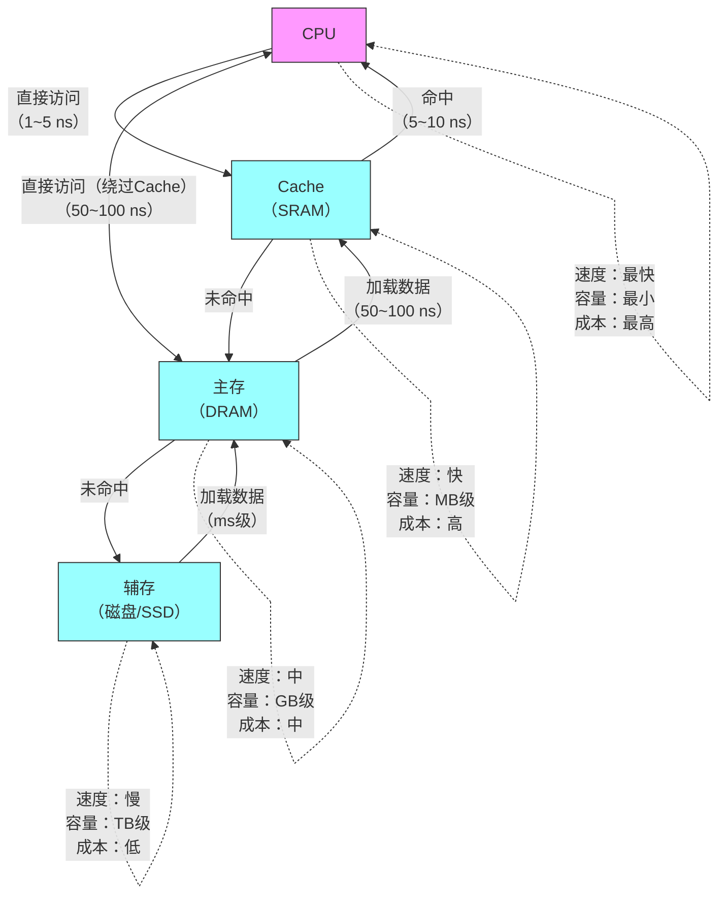

## 是否深陷原码反码补码的漩涡无法自拔，掌握overflow的概念就可以挣脱
==up主 饭神来了 408补习班第八期==
int 在计算机中是有限的整数序列
既然是有限的，那就必然有溢出（Overflow）
溢出因为bit的位数是固定的

引入负数/有符号数的二进制表示后：
**存在两个问题**：
- 0有+0和-0两种表示
- 负数的加减法doesn't work
**eg.** 001(1)+101 (-1)= 110(-2)
**To make it work**:
引入另外一种表示法
让001+（-1）=000
那这个-1应该用什么表示呢，没错就是111
001 + 111 = 1 000（发生了溢出）
**找到了-1的表示，那-2怎么表示呢?**
- -1 -1 =-2
- 111 -001 = 110
可以看到it still works
验证一下：
- -2 +2 =0
- 110 + 010 = 1 000（overfow）对了
- -2 + 5 =3
- 110 + 101 =  1 011（overflow）对了 
**下面用简单的方式找到-x的表示方法**：
Flipping each bit and adding 1:
-x = ~x+1
5
- 0101 This is 5
- 1010 This is the "Ones complement of 5" 5 with bit filpped
- 1011 This is the "Twos complement of 5" 5 with bit filpped and added 1
比如前面的-1 
- 01 flip 10
- add 1 ->11
- 加上符号111
把111称为1的Twos complemnt of 1
"**Ones complement of** x"在中文教材里被翻译为**反码**
"**Twos complement of x**"在中文教材里被翻译为**补码**
[[补码相关|对于相关翻译deepseek的理解]]

 **They are called complements because complementary bits are set.If they are added, all bits are necessarily set:**
 **把比特位填满**
 0101 +1010 =1111

**Adding 1 to the  sum of a number and its complement necessarily results in a 0 due to overflow** 
**通过+1溢出得到0**
(0101 + 1010 ) + 1 = 1111 +1 = 1 0000 （0）
**这完美利用了溢出的方式实现了对一个数负数的表示**

**And if x+y=0,y must equal -x**

补码的引入是为了解决负数的计算，利用了溢出(overflow)的概念使得正数+负数=0
有符号数以及无符号数对于二进制数的映射
**拆解**：
对于有符号数可以看成一个最大的负数加上一个正数，
如1010
- 1000 （-8）
- 0010  （2）
- 1000 + 0010 = 1010 (-8 +2 =-6)
同理对于无符号数拆成一个最大的正数加上一个正数：
- 1000 （8）
- 0010 （2）
- 1000 + 0010 =1010 （8+2=10）
![[Pasted image 20250311154037.png]]
## 第三章 存储系统
[[考纲#三、存储器层次结构|408大纲]]
### 层次结构

 ==主存-辅存==之间交换 由硬件和操作系统完成 系统程序员需要完成操作系统的页面置换算法
- 实现虚拟存储系统，解决主存容量不够的问题
==cache-主存==之间交换由硬件工程师实现 对于系统程序员是透明的
- 解决了CPU 主存之间速度不匹配的问题
### 分类
1. 按照层次分类
2. 按存储介质分类
3. 按存取方式分类
4. 按信息的可更改性
5. 按信息的可保存性
- DRAM和SRAM [[RAM相关]]
### 性能指标
- 存储容量
- 单位成本（每bit价格）
- 数据传输率（主存带宽）
- 存储周期=存取时间+恢复时间
### 存储器芯片基本结构
- 存储体
- MAR
- MDR
![[Screenshot_2025-03-09-15-40-51-823_tv.danmaku.bili.jpg]]
字位线的理解参考这个视频：【用最好的动画为你讲解--内存的原理-哔哩哔哩】 https://b23.tv/QW3yoVf

### SRAM和DRAM
- DRAM Dynamic Random Access Memory 动态RAM
- SRAM Static Random Access Memory 静态RAM
- SDRAM Synchonous Dynamic Random Access Memory 动态RAM
都属于**断电易失**

**~~DRAM~~用于主存**（现过时，通常采用**SDRAM**）
- 使用**栅极电容**存储信息，破坏性读出，需要重写，速度更慢
- 每个存储源电路简单，制造成本更低，集成度高，功耗低
- 需要刷新
- 分两次送行列地址（地址线复用技术->地址线、地址引脚减半）
**SRAM用于cache**
- 使用**双稳态触发器**存储信息，非破坏性读出，无需重写，速度更快
- 每个存储元电路较栅极电容更复杂，集成度成本更高，集成度低，功耗大
- 无需刷新
- 同时送行列地址（集成度低）
**DRAM的刷新**
多久刷新一次：刷新周期，通常是2ms
每次刷新多少存储单元：一行
使用行列地址：减少选通线的数量 16x16 ->16+16
如何刷新：有硬件支持，读出一行信息，然后把这个信息重新写入，占一个读写周期
在什么时候刷新：
- 分散刷新
- 集中刷新
- 异步刷新

### ROM
- **MROM** Mask Read-Only Memory 掩模式只读存储器 芯片生产时写入，任何人不可重写
- **PROM** Programmable 可用专用的PROM写入器写入写一次后就不能读写
- **EPROM** Erasable Programmable 可进行多次重写
- **UVEPROM** Ultraviolet rays 紫外线照射擦除，只能==擦除全部==
- **EEPROM**($E^2$PROM) 采用电擦除，==擦除特定的字==
- **Flash Memory** (eg.U盘，sd卡) 断电后也能保存信息，由于写入要擦除，因此写比读慢
- **SSD** Solid State Disk 由控制单元和存储单元（Flash芯片）组成，控制单元和闪存不一样
**实际上主板上保存BIOS的ROM芯片也是主存的一部分，与RAM二者统一编址**

### 详细内存布局表

| 地址范围            | 类型   | 用途        |
| --------------- | ---- | --------- |
| `0x0000~0x03FF` | ROM  | BIOS/固件存储 |
| `0x0400~0x7FFF` | RAM  | 程序运行和数据存储 |
| `0x8000~0x8FFF` | VRAM | 显存        |
| `0x9000~0xFFFF` | I/O  | 外设 I/O 映射 |

- 很多ROM也能进行写入
- 很多ROM也具有随机存取的特性
- 闪存写入更慢因为要擦除

### 多模块存储器
读取周期
T = r + 3r
读取时间(总线传输周期)r 恢复时间3r 读取时间r 恢复时间3r 

 **多体并行存储器**
 - 高位交叉编址

| 体号  | 体内地址 |
| --- | ---- |
| 00  | 000  |
 

 - 低位交叉编址

| 体内地址 | 体号  |
| ---- | --- |
| 000  | 00  |
适合连续访问存储
$$
\boxed{存储体的个数要m\leq T/r,可以流水线保证连续存取不遇到恢复时间}
$$
**单体多字存储器**
只能CP一次读一整行，会有冗余信息

## 主存储器和CPU的连接
- **单块存储器与CPU的连接**
数据总线宽度=主存存储字长，才能尽可能发挥数据总线的性能

单块存储芯片的数据字长<数据总线宽度
**位扩展** 一个**8K x 1位**的存储芯片，代表这个芯片有8K个存储单元 每个存储单元存储1bit
假设**数据总线宽度**为8位，$D_0 \sim D_7$这时一个存储芯片只能连接一位，比如$D_0$,这时再拿七个一样的存储芯片链接到$D_1 \sim D_7$，这时这八个存储芯片组合起来就变成了一个8K x 8位的存储芯片，存储芯片的位数从1位拓展到了8位，称为**位扩展**

**字扩展** 一个8K x 8位的存储芯片，位数已经和总线的位数相同了，这时数据总线的性能以及最高了，不需要拓展位，要拓展存储器的存储字数
假设CPU的地址总线有16位$A_0\sim A_{15}$,而这个存储芯片有8K个存储单元，要寻址8K个存储单元（$2^{13}$个）需要13位地址线，但地址总线有16位，就存在三位的浪费，如果像位扩展一样把地址线数据线连到同一根总线上，CS(chip select)信号都为一，多个芯片就会同时向数据总线发信号，会会造成信号冲突（位扩展时一个芯片对应了一个（或多个）单独的数据总线），如果把剩下的三根地址总线$A_{13} \sim A_{15}$连到存储芯片的CS片选信号上，如果$A_{13} \sim A_{15}$同时有两根及以上的信号为1，还是有多个芯片收到片选信号，向数据总线发送信号，造成数据冲突。
这时如果是有两个存储芯片进行字扩展，指定$A_{13} A_{14}$只能为01或10，这样不会造成数据冲突，称为**线选法**，但是开头只能是10 01,00和11的情况就被浪费掉了，如果CPU有n位多余的地址总线，则能连接n个存储芯片。
改进一下，把一根多余的A,连接到两个片选信号上，但其中一个加上非门（1，2）译码器，这时一位A就能链接两个存储芯片，再拓宽思路3根线可以表示$2^3=8$个数，因此可以用3-8译码器把3个A连到8个存储芯片上
以这个原理译码器命名规则应该是$n-2^n$译码器、

结合一下还有**字位同时扩展**法

**译码器** 除了$n和2^n$个引脚外可能还会有**使能信号**引脚，如果有多个使能引脚，例如**74ls138**有三个，两个低电平有效一个高电平有效，CPU可以使用译码器的使能端控制片选信号生效时间，CPU **MREQ**连接使能端，cpu先送出地址信号，等一会电流稳定后再通过MREQ控制译码器使能，从而发送片选信号