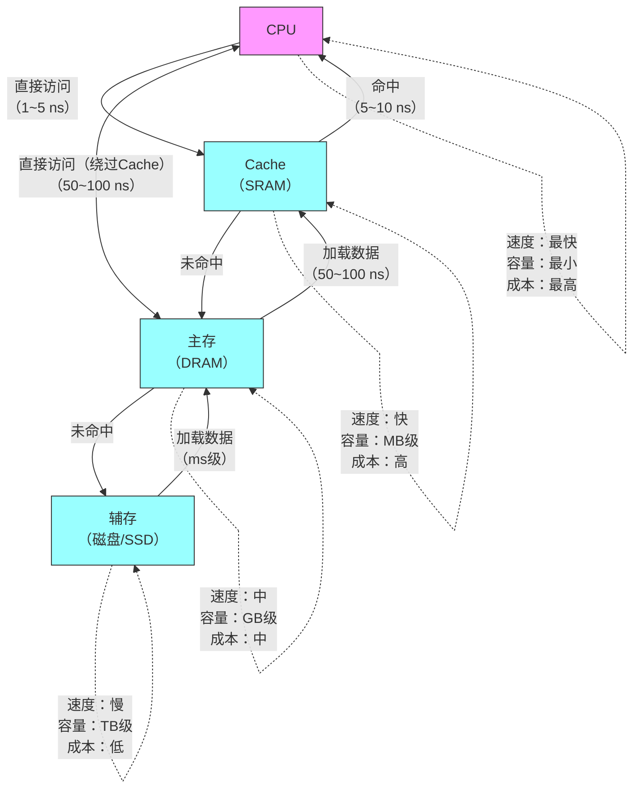

## 第三章 存储系统
[[考纲#三、存储器层次结构|408大纲]]
### 层次结构

 ==主存-辅存==之间交换 由硬件和操作系统完成 系统程序员需要完成操作系统的页面置换算法
- 实现虚拟存储系统，解决主存容量不够的问题
==cache-主存==之间交换由硬件工程师实现 对于系统程序员是透明的
- 解决了CPU 主存之间速度不匹配的问题
### 分类
1. 按照层次分类
2. 按存储介质分类
3. 按存取方式分类
4. 按信息的可更改性
5. 按信息的可保存性
- DRAM和SRAM [[RAM相关]]
### 性能指标
- 存储容量
- 单位成本（每bit价格）
- 数据传输率（主存带宽）
- 存储周期=存取时间+恢复时间
### 存储器芯片基本结构
- 存储体
- MAR
- MDR
![[Screenshot_2025-03-09-15-40-51-823_tv.danmaku.bili.jpg]]