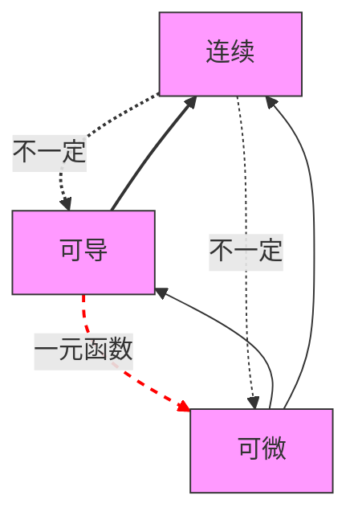

## 第一章 函数 极限 连续
---
### 复合函数 
条件：外函数定义域与内函数值域交集不为空
### 反函数
存在反函数条件：对于一个函数，一个y只能有一个唯一对应的x
==单调函数一定有反函数== 反之不然
==arccosx==取得是 cosx 定义域  $[0,\pi]$那一段,因为这一段才能保证唯一对应。而arcsinx与arctanx取的是$[-\frac{\pi}{2},\frac{\pi}{2}]$那一段

### 奇偶性
求奇偶性 可以用f(-x)+f(x)=0的变形
奇函数 0点处若有定义则f(0)=0

### 周期性
$\text{若 } f(x) \text{ 以 } T \text{ 为周期，则 } f(ax + b) \text{ 以 } \frac{T}{|a|} \text{ 为周期。}$
[[推导#p5 3.周期性 (2)|推导过程]]

### 有界性
$$
设y=f(x)在集合X上有定义，\exists M>0,使得\forall x \in X,\\ 恒有|f(x)| \leq M,则称f(x)在X上是有界函数。
$$
无界函数的定义：  
$$
设 y = f(x) 在集合 X 上有定义，若 \forall M > 0，存在至少一个  x_0 \in X ，使得 |f(x)| > M ，则称 f(x) 在 X 上是无界函数。
$$
==p6.例5== 利用三角函数周期性消除有界变量的影响

### 数列极限
- 如果对于任意的$\epsilon \gt 0$,总存在正整数N,当n>N时，恒有 $|x_n - a| \lt \epsilon$成立，则称常数a为数列{$x_n$}当n趋于正无穷时的极限，记为$\lim\limits_{n \to \infty} x_n = a$
- $$\lim\limits_{n \to \infty} x_n = a \iff \lim\limits_{k \to \infty} x_{2k-1} = \lim\limits_{k \to \infty} x_{2k} =a$$
- $|x_n|-|a||和|x_n-a|大小比较$  -> [[绝对值不等式]]

### 函数极限
- 自变量趋于无穷大
对于任意给定的$\epsilon \gt 0$,总存在X>0,当|x|>X,时恒有|f(x) - A|<$\epsilon$,则称常数A为f(x)当x->$\infty$时的极限，记为$\lim\limits_{x \to \infty} f(x)$的极限，记为$\lim\limits_{x \to \infty} f(x)=A$
做题时$\lim\limits_{x \to \infty} f(x)=A$分解为$\lim\limits_{x \to +\infty} f(x)=A$和$\lim\limits_{x \to -\infty} f(x)=A$
- 自变量趋于有限值
对于任意给定的$\epsilon \gt 0$,总存在 $\delta \gt 0$,当$0\lt|x-x_0|\lt\delta$,恒有|f(x) - A|<$\epsilon$,则称常数A为f(x)当x->$x_0$时的极限，记为$\lim\limits_{x \to x_0} f(x)$的极限，记为$\lim\limits_{x \to x_0} f(x)=A$
做题时$\lim\limits_{x \to x_0} f(x)$分解为$\lim\limits_{x \to x_0^+} f(x)$和$\lim\limits_{x \to x_0^-} f(x)$
- 需要考虑分段的函数 
1. 分段函数的分段点（包括带绝对值的函数）
2. $e^\infty$型
3. $arctan\infty$型、
==p.11例4==思路错误,首先把arctan$\infty$的极限当成了+_1,其次把$1^\infty$的值当成1，错误原因在于$\lim\limits_{x \to 0}(1+x)^{\frac{1}{x}}$是个$1^\infty$型极限，要使用$e^{\lim\limits_{x \to 0}lnf(x)}$计算，或参考p18方法1 2.的结论

### 极限的性质
**与极限相关有界性**：
[[高数#有界性]]
- 数列：
如果数列{${x_n}$}收敛（有极限），那么数列{$x_n$}一定有界
反之不成立，如$(-1)^n$
- 函数：
若$\lim\limits_{x \to x_0} f(x)$存在，则f(x)在$x_0$某去心邻域有界（局部有界）
反之不存在，如：$f(x)=\lim\limits_{x \to 0}sin(\frac{1}{x})$
![[Pasted image 20250309214842.png]]
**与极限相关保号性**：

应用：根据保号性求[[极值定义|极值]]

**极限值与无穷小之间关系**：
$$\lim f(x) = A \iff f(x)=A+\alpha(x) $$其中$$lim\alpha(x)=0$$
### 极限的存在准则 
**夹逼**
取整函数基本不等式
$$x-1<[x]\leq x <[x]+1$$
**单调有界数列必有极限**

### 无穷小量
比较无穷小的时候就要用等价无穷小代换

无穷小性质
==有限==个无穷小的和（积）仍为无穷小
无穷小量与有界量的积仍为无穷小

### 无穷大量
**定义**：

**常用比较**
- 函数
$$当x\to+\infty时，ln^\alpha x<<x^\beta<<a^x,其中\alpha >0,\beta>0,a>1.$$
- 数列
$$当n\to\infty时，ln^\alpha n<<n^\beta<<a^n<<n!<<n^n,其中\alpha >0,\beta>0,a>1.$$
**性质**：
- 有限个个无穷大量的积仍为无穷大量
- 无穷大量与有界变量之==和==仍为无穷大量,不要误以为无穷大与有界之积为无穷大
**与无界变量关系**：
$$\boxed {无穷大量必为无界变量，无界变量不一定是无穷大量 }$$
**与无穷小量关系**：互为倒数，但f(x)（分母）不能为0
[[无穷大量|例14]]
### 求极限
- 利用基本极限求极限
- 利用等价无穷小代换求极限
原则：乘除关系可以换，加减关系在一定条件下可以换
相减时，被替换的被减数和减数不能是同阶无穷小，且比值不能等于1
相加时，被替换的被减数和减数不能是同阶无穷小，且比值不能等于-1
- 利用有理运算法则求极限
- 利用洛必达法则求极限
洛必达法则：
若 $\lim\limits_{x \to x_0} f(x) =\lim\limits_{x \to x_0} g(x) =0(\infty)$
$f(x)和g(x)在x_0的某去心邻域内可导$
$\lim\limits_{x \to x_0} \frac{f'(x)}{g'(x)}存在(或\infty)$
则$\lim\limits_{x \to x_0} \frac{f(x)}{g(x)} =\lim\limits_{x \to x_0} \frac{f'(x)}{g'(x)}$
- 使用夹逼准则求极限
- 利用单调有界准则求极限
- 利用定积分定义求极限
### 无穷小量阶的比较
$1-cos^\alpha x \sim \frac{\alpha}{2}x^2$这个公式，可以利用$(1+x)^\alpha-1 \sim \alpha x$推导，把$cos^\alpha x$里面的cosx+1-1即可o
### 函数的连续性
定义理解：函数在一点处的极限值等于函数值，则称函数在这一点连续，区间上每个点都连续称函数在这个区间内连续
### 间断点及其分类跳跃间断点
定义理解:在一点左右（去心邻域）有定义，在这个点不连续
**第一类间断点**
左右极限都存在的间断点
- **可去间断点** 左右极限相等
- **跳跃间断点** 左右极限不等
**第二类间断点**
左右极限至少有一个不存在
- **无穷间断点** 左极限或右极限为无穷
- **振荡间断点** 
### 连续性的运算与性质
### 闭区间上连续函数的性质
**最值定理**：
		$设f(x)在闭区间[a,b]上连续，则f(x)在[a,b]上必有最大值和最小值$
**有界性定理**：
		$设f(x)在闭区间[a,b]上连续，则f(x)在[a,b]上必有界$
**介值定理**：
$$
\begin{gathered}设f(x)在闭区间[a,b]上连续，且f(a)\neq f(b),则对于任意介于f(a)与f(b)之间的数C，\\
至少存在一点\epsilon\in (a,b),使f(\epsilon) =C
\end{gathered}$$
推论：$若f(x)在闭区间[a,b]上连续，则f(x)在[a,b]上可取到介与最小值m与最大值M直接的任何值$
**零点定理**：
		$设(x)在闭区间[a,b]上连续，且f(a)\cdot f(b) \lt 0,则至少存在一点，\epsilon \in (a,b),使f(\epsilon)=0$ 
**重要应用**：证明方程根的存在性？

## 第二章 导数与微分
### 导数与微分的概念

**导数** 定义：设函数f(x)在$x_0的某领域内有定义，如果极限\lim\limits_{\Delta x \to 0}\frac{\Delta y}{\Delta x}=\lim\limits_{\Delta x \to 0}\frac{f(x_0+\Delta x)-f(x_0))}{\Delta x}$存在,则称f(x)在点$x_0$处可导，并称极限值为f(x)在$x_0$处的导数。 左极限值为左导数，右极限值为右导数 $$可导\iff 左右导数都存在且相等（类比极限）$$ 
**微分** 定义：设函数f(x)在点$x_0的某一领域内有定义，如果函数的增量\Delta y=f(x_0+\Delta x)-f(x_0)可以表示为$ $$ \Delta y=A\Delta x+o(\Delta x),(\Delta x \to 0) $$ 其中A为不依赖\Delta x的常数，则称函数f(x)在点$x_0$处可微，称$A\Delta x$为函数f(x)在点$x_0$处相应于自变量增量$\Delta x$的微分，记为$dy=A\Delta x$ 具体理解： ![[Pasted image 20250316205912.png]]
## 导数与微分的几何意义 
法线与切线成90度夹角
$$\boxed {可导 \rightarrow 有切线,反之不成立，如x^\frac{1}{3}在x=0处导数趋于无穷大}$$
**微分的几何意义**：
微分dy在几何上表示函数切线上的增量
$\Delta y表示的是函数的增量$

$函数f(x)可导 \nrightarrow 导函数连续$
$函数f(x)可导 \nrightarrow 导函数极限存在$
如$f(x)= \begin{cases} x^{2}\sin\frac{1}{x}, & x\neq0, \\ 0, & x=0. & \end{cases}$

**导数公式及求导公式**:
**基本初等函数求导公式**
$\begin{aligned} & \left(1\right)\left(C\right)^{\prime}=0; & & \left(2\right)\left(x^{a}\right)^{\prime}=\alpha x^{a-1}; \\ & \left(3\right)\left(a^{x}\right)^{\prime}=a^{x}\ln a; & & \left(4\right)\left(e^{x}\right)^{\prime}=e^{x} \\ & \left(5\right)\left(\log_{a}x\right)^{\prime}=\frac{1}{x\ln a}; & & \left(6\right)\left(\ln|x|\right)^{\prime}=\frac{1}{x}; \\ & \left(7\right)\left(\sin x\right)^{\prime}=\cos x; & & \left(8\right)\left(\cos x\right)^{\prime}=-\sin x; \\ & \left(9\right)\left(\tan x\right)^{\prime}=\sec^{2}x; & & \left(10\right)\left(\cot x\right)^{\prime}=-\csc^{2}x; \\ & & & \left(12\right)\left(\csc x\right)^{\prime}=-\csc x\cot x; \\ & \left(11\right)\left(\sec x\right)^{\prime}=\sec x\tan x; \\ & \left(13\right)\left(\arcsin x\right)^{\prime}=\frac{1}{\sqrt{1-x^{2}}}; & & \left(14\right)\left(\arccos x\right)^{\prime}=-\frac{1}{\sqrt{1-x^{2}}}; \\ & \left(15\right)\left(\arctan x\right)^{\prime}=\frac{1}{1+x^{2}}; & & \left(16\right)\left(arccotx\right)^{\prime}=-\frac{1}{1+x^{2}}. \end{aligned}$
3.利用$e^{lnx}$代换计算后换回来5.使用换底公式求导 7 8利用导数定义求导sin(x+\Delta x)的形式展开后用等价无穷小代换 9. 10. 要用到
$$
\begin{align}
\tan^2x + 1 &= \sec^2x \\
1 + \cot^2x &= \csc^2x
\end{align}
$$
(13) 14. 15. 16.使用反函数求导的公式$\frac{dy}{dx}=\frac{1}{\frac{dx}{dy}}$,再利用arc(arcsinx)=sinx arc(arcosx)=cosx  arc(arctanx)=tanx  arc(arccotx)=cotx  
**求导法则**
- 有理运算法则
- 复合函数求导
- 隐函数求导法
- 反函数的导数
- 参数方程求导法 （利用反函数的导数结论推导）
- 对数求导法

**高阶导数**
**常用公式**
- $(sinx)^{(n)}=sin(x+n\cdot \frac{\pi}{2})$
- $(cosx)^{(n)}=cos(x+n\cdot \frac{\pi}{2})$
- $(u+v)^{(n)}=u^{(n)}+v^{(n)}$
- $(uv)^{(n)}=\sum_{k=0}^{n} {C^k_n}u^{(k)}v^{(n-k)}$

充分必要
$A\implies B$ ,则A是B的充分条件，B是A的必要条件